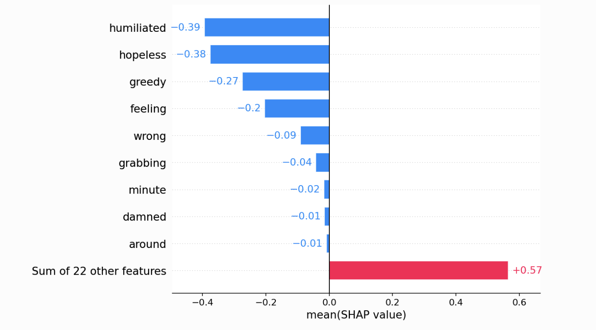

# ml-interpretability

A project exploring model interpretability techniques for factual classification. The goal is to understand how models determine the factual accuracy of text statements by:

1. Using n-gram models to extract features from text and then comparing with vector embeddings.
2. Building and hyperparameter tuning ensemble models
3. Exploring feature importance and model explainability through a variety of interpretability techniques
4. Using SHAP to explain the model's predictions

Inspired by Christoph Molnar's [Interpretable Machine Learning](https://christophm.github.io/interpretable-ml-book/) book.
